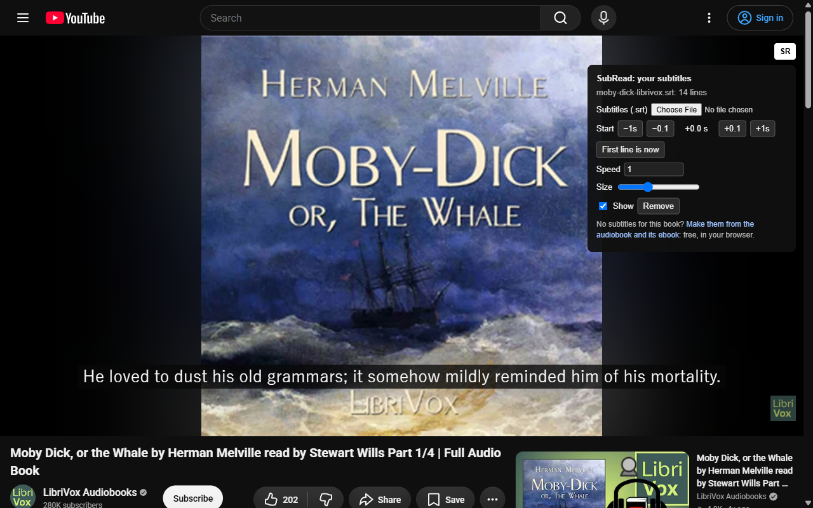
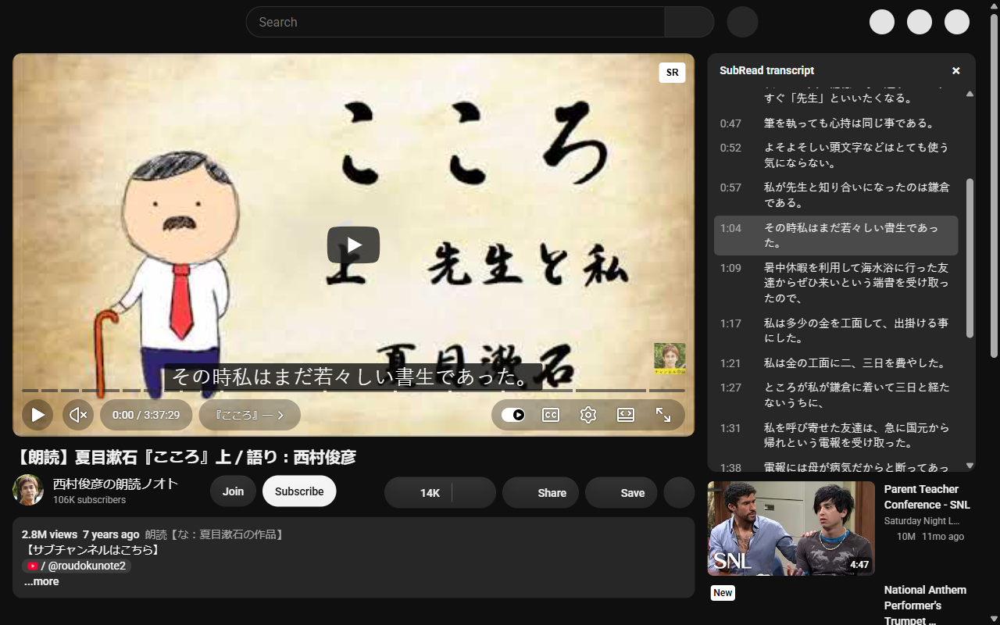

# SubRead for YouTube (Chrome and Firefox)

Shows your own `.srt` over a YouTube video, in time with it. It is made for
audiobooks on YouTube: make book-accurate subtitles at
[subread.space](https://subread.space) from the audiobook and its ebook (free,
in the browser), then read along on the video.

Press **SR** at the top right of the player, and choose the `.srt`.

The subtitles in the pictures are in `store/demo/`. More languages are in `store/graphics/`.

- **Start**: the video on YouTube often has an intro that your audio file does
  not. Play to where the narrator reads the first line and press
  **First line is now**, or move the start by 0.1 s and 1 s.
- **Speed**: for an upload that runs a little faster or slower than your file.
- The subtitles and these settings are kept for each video (the newest 8).
- **Transcript**: shows SubRead's own transcript panel next to the video, filled
  with your subtitles. Click a line to jump the video to it.

## What it does not do

It does not read, record or download the video or its sound, and it sends
nothing anywhere. The one permission is `storage`, to keep your subtitles in
the browser. The stores do not allow an extension that takes media from
YouTube, and YouTube's terms do not allow it; this one only draws text.

## Layout

| Path | What |
|---|---|
| `manifest.json` | Manifest V3, the same for both browsers (`browser_specific_settings` is for Firefox) |
| `src/srt.js` | Reads .srt and .vtt; finds the cue for a moment. No browser APIs, so Node tests it |
| `src/content.js`, `src/content.css` | The caption box, the **SR** button and the panel, inside `#movie_player` |
| `popup.html` | How to use it, and the links to the other apps |
| `tests/srt.test.cjs` | `node --test tests/srt.test.cjs` |
| `tests/more-apps.test.cjs` | `node --test tests/more-apps.test.cjs` |
| `tests/mock/server.py` | A stand-in for a watch page, to try the content script by hand |
| `tools/pack.py` | Makes `dist/subread-chrome.zip` and `dist/subread-firefox.zip` |
| `tools/graphics.py` | Makes the Chrome promo tiles in `store/graphics/` |
| `tools/shots/` | Takes the store screenshots in Brave over CDP |
| `store/listing.md` | The texts and answers for the two stores |

## Try it

Chrome: `chrome://extensions` > Developer mode > Load unpacked > this folder.
Firefox: `about:debugging` > This Firefox > Load Temporary Add-on > `manifest.json`.

## More projects

- [SubRead](https://subread.space/): read along with an audiobook, in the browser.
  Also [for Android](https://github.com/equwal/subread-android/releases/latest),
  [for YouTube](https://github.com/equwal/subread-extension/releases/latest)
  and [for KOReader](https://github.com/equwal/subread.koplugin).
- [SubRead Overlay](https://github.com/equwal/subread-overlay/releases/latest): subtitle lines over any Android media player.
- [SubRead Dictionary](https://github.com/equwal/subread-dictionary/releases/latest): a pop-up dictionary for Android that reads Yomitan dictionaries.
- [SubRead Anki](https://github.com/equwal/subread-anki): one tap makes an Anki card from any Android app.
- [Subrep](https://github.com/equwal/subrep-android/releases/latest): live captions of the sound of your phone.
- [Book Simulator](https://booksimulator.com/): a reading room for Aozora Bunko and Project Gutenberg books.
- [honjimaku.com](https://honjimaku.com/): subtitles for Japanese audiobooks.
- [sbm Sync](https://sbmsync.com/): your bookmarks, the same on every device,
  with [sbm](https://github.com/equwal/sbm) for dmenu,
  [sbm for Android](https://github.com/equwal/sbm-android/releases/latest)
  and the [sbm add-on](https://github.com/equwal/sbm-extension/releases/latest) for Firefox and Chrome.
- [Rebind](https://github.com/equwal/rebind/releases): remap the hardware buttons of e-ink readers and Android,
  with [Ink Recents](https://github.com/equwal/ink-recents/releases/latest),
  [Ink Dim](https://github.com/equwal/ink-dim/releases/latest)
  and [Ink Update](https://github.com/equwal/ink-update/releases/latest).
- [dickt.store](https://dickt.store/): language-learning tools, flashcards and web toys.
- [hentaibun.online](https://hentaibun.online/): learn kanbun and kobun.
- [Recently Written](https://recentlywritten.com/): the blog, and a list of [all projects](https://recentlywritten.com/projects.html).

## Licence

AGPL-3.0: see `LICENSE`.
